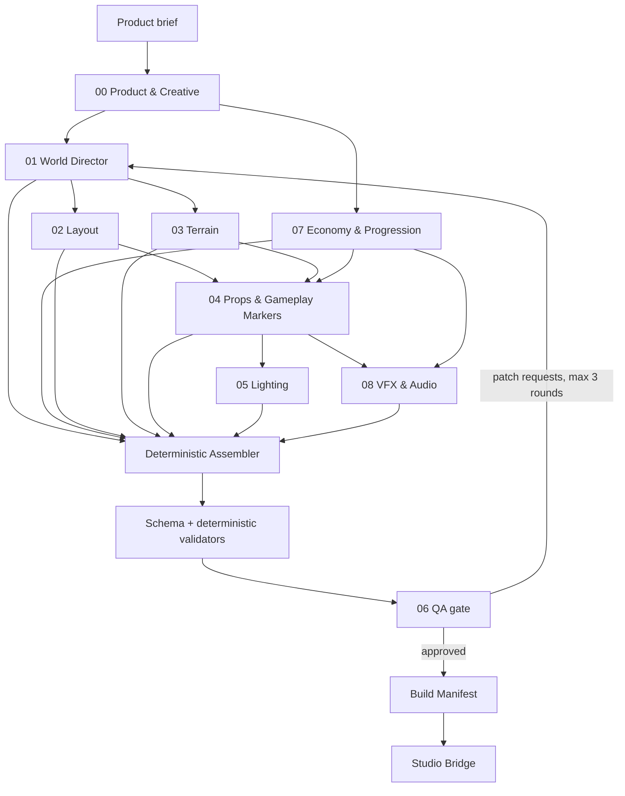

# Shadow Army Rebirth — Design and Generation Specification

Version 2.0 is the source of truth for an anime minion battler built for Roblox. The repository defines the player experience, economy, generated-world contracts, validation gates, and the boundary between the build pipeline and the live game.

This repository is a specification and build-contract package. It includes a bounded Agent Runner with replay and optional OpenAI Responses providers, deterministic artifact validation, seeded pipeline orchestration, immutable content-addressed storage, manifest assembly, and a non-mutating Studio Bridge dry run. It does **not** yet contain a runnable game, provide a mutating Studio plugin, or include production assets.

## Product promise

Within the first minute, a new player commands a visible shadow squad, destroys an enemy, receives an exaggerated power increase, and sees the boss they will eventually extract. The fantasy is not “wait for numbers”; it is “I am becoming the Shadow Monarch, and my army proves it.”

## Source-of-truth order

When documents disagree, use this order:

1. `game_concept.md` — player promise, progression, economy, ethics, and content template.
2. `agent.md` — pipeline architecture, ownership, validation, security, and runtime boundary.
3. `schemas/pipeline.schema.json` — machine-readable interchange contract.
4. `agents/*.md` — agent behavior and domain-specific acceptance criteria.
5. Examples — illustrative only; examples never override schemas or design rules.

Every generated artifact must include `schemaVersion`, `buildId`, and deterministic IDs. Breaking contract changes increment the major version.

## Pipeline



LLMs propose bounded artifacts. Code performs schema validation, graph checks, geometry checks, budget accounting, probability totals, referential integrity, and security linting. QA cannot approve a build that fails a deterministic validator.

## Repository map

```text
roblox-map-builder/
├── README.md
├── game_concept.md
├── agent.md
├── docs/
│   ├── implementation-readiness.md
│   └── roblox-references.md
├── schemas/
│   ├── pipeline.schema.json
│   └── build-manifest.schema.json
├── validation/              # Python schema + deterministic validator CLI
├── agent_runner/            # Provider adapters, bounded repair loop, provenance
├── orchestrator/            # Dependency graph, lineage checks, immutable store
├── manifest/                # Validated artifact → deterministic manifest
├── studio_bridge/           # Non-mutating allowlist/budget/reference dry run
├── roblox_plugin/           # Native Studio plugin source and adapter
├── registry/                # Bridge allowlist and logical asset registry
├── fixtures/                # Valid World 1 golden build and invalid fixtures
├── tests/                   # Contract and cross-artifact tests
├── tools/                   # Deterministic fixture generator
├── pyproject.toml
└── agents/
    ├── README.md
    ├── 00_creative_ideation_agent.md
    ├── 01_director_agent.md
    ├── 02_layout_planner_agent.md
    ├── 03_terrain_shaper_agent.md
    ├── 04_prop_placer_agent.md
    ├── 05_lighting_atmosphere_agent.md
    ├── 06_qa_auditor_agent.md
    ├── 07_economy_systems_agent.md
    └── 08_vfx_audio_agent.md
```

## MVP definition

The first playable vertical slice is one 256×256-stud island with:

- a spawn-to-first-kill time below 20 seconds;
- one free starter shadow and no forced shop interaction;
- one farm lane, one mini-boss, one boss arena, and one visible next-world gate;
- one server-authoritative combat loop, one gacha pool funded only by earned soft currency, and one rebirth;
- mobile, keyboard/mouse, and gamepad input;
- save migration, receipt idempotency, remote validation, analytics funnels, and performance profiling;
- an approved build manifest reproducible from a fixed seed.

## Definition of done for specifications

- All IDs resolve across artifacts.
- All random reward tables total exactly 100% in integer basis points.
- All currencies have at least one source, one sink, and a target time-to-afford.
- All required paths are connected and have clearance volumes.
- Gameplay state is server-authoritative; clients request intents and render presentation.
- Economy values use safe integer units; formatting is separate from storage.
- Monetization is transparent, age/location policy aware, and never required to complete onboarding.
- QA covers economy, terrain, VFX/audio, security, accessibility, performance, and data migration.

## Implementation order

1. Lock `pipeline.schema.json` and build validators/fixtures.
2. Implement a seeded orchestrator and immutable artifact store.
3. Implement Studio Bridge dry-run, diff preview, undo, and allowlisted instance/property creation.
4. Build the World 1 vertical slice with placeholder art.
5. Instrument the onboarding and economy funnels before scaling content.
6. Profile on low-end mobile and revise measured budgets before adding worlds.

## Validator quick start

```powershell
python -m pip install -e .
python tools/generate_world01_fixtures.py
python -m validation fixtures/world_01_shadow_forest
python -m agent_runner "Create World 1" --build-id world01-local-001 --seed 48151623 --provider replay
python -m orchestrator fixtures/world_01_shadow_forest --store build/artifact-store --manifest-output build/world01.orchestrated.build_manifest.json
python -m manifest fixtures/world_01_shadow_forest --output build/world01.build_manifest.json
python -m studio_bridge build/world01.build_manifest.json
python -m studio_bridge.control_cli diff fixtures/manifests/world_01_shadow_forest.build_manifest.json --state build/bridge-state.json --output build/bridge-plan.json
python -m unittest discover -s tests -v
```

The checked-in World 1 artifacts and generated manifest are the golden contract for the E-Rank Shadow Forest vertical slice. Their dependency hashes are real canonical content hashes, so stale downstream outputs are rejected. The replay provider exercises the complete Agent Runner without network calls. A dry run may pass while `releaseReady` remains false: placeholder audio registry entries intentionally block a production release. The native plugin source must still pass `docs/native-studio-verification.md` inside Roblox Studio. See `agent_runner/README.md`, `orchestrator/README.md`, `validation/README.md`, `studio_bridge/README.md`, `roblox_plugin/README.md`, and `fixtures/README.md`.
